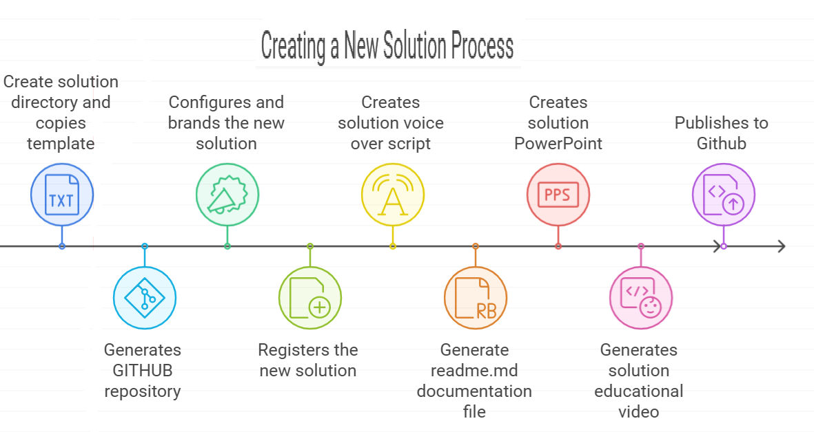

    
# Create Solution 

## Template for kick starting sophisticated python projects 

    

    

## Overview of Create Solution 
The **Create Solution** application streamlines development by generating a customizable solution template, which is then tailored and configured to specific project requirements. Following customization, it seamlessly initiates Git version control and pushes the configured solution to GitHub, ensuring efficient collaboration and version management within the development workflow.

## Process for creating a new solution: 
1. Create solution directory and copies template
2. Generates GITHUB repository 
3. Configures and brands the new solution 
4. Registers the new solution 
5. Creates solution voice over script
6. Generate readme.md documentation file  
7. Creates solution PowerPoint 
8. Generates solution educational video  
9. Publishes to Github
10. Optional - Publishes to Youtube

## Detailed explanation of Create Solution 

Here’s a detailed explanation of each step in the process for creating a new AI solution:

---

### **1. Create Solution Directory and Copy Template**
   - **What happens**: A new project directory (folder) is created to house the AI solution. A pre-existing **solution template** is copied into this directory. This template includes a basic structure (e.g., folders for code, documentation, assets, etc.) and skeleton code or configuration files that can be customized to meet the specific needs of the solution.
   - **Why it’s important**: Starting with a template ensures that the project is well-organized from the beginning, following best practices and standards for solution development.

---

### **2. Generate GitHub Repository**
   - **What happens**: The process automatically creates a new **GitHub repository** for the project. This is where all files, code, and version history will be stored and managed. It sets up the repository on GitHub either as a private or public repository based on project requirements.
   - **Why it’s important**: Using a GitHub repository ensures that version control is in place, making it easier to collaborate with team members, track changes, and manage different versions of the solution.

---

### **3. Configure and Brand the New Solution**
   - **What happens**: The solution is customized to reflect the project-specific requirements. This includes setting up configurations, adapting the code, and **branding** the solution with logos, color schemes, and any specific visual identity elements that represent the organization or the solution's purpose.
   - **Why it’s important**: Branding and proper configuration help align the solution with organizational standards and create a polished product that reflects the client's or team's identity.

---

### **4. Register the New Solution**
   - **What happens**: The solution is **registered** within the internal systems or a project management tool. This may involve adding the solution to a database or management system that tracks all active projects, their status, and key information.
   - **Why it’s important**: Registering the solution ensures it is part of a larger ecosystem or workflow, allowing stakeholders to track progress, assign resources, and manage the project lifecycle.

---

### **5. Create Solution Voice Over Script**
   - **What happens**: A **voiceover script** is generated for educational or marketing materials that explain the solution. The script outlines key points, such as the solution’s purpose, how it works, and its benefits, designed to be narrated in an accompanying video or presentation.
   - **Why it’s important**: Having a clear and concise voiceover script ensures that messaging about the solution is consistent, professional, and easy to understand for both internal and external audiences.

---

### **6. Generate `README.md` Documentation File**
   - **What happens**: The process generates a `README.md` file, a key documentation file in GitHub repositories. This file typically includes an overview of the solution, installation instructions, usage details, and any dependencies or prerequisites.
   - **Why it’s important**: `README.md` serves as the primary documentation for users and collaborators. It’s often the first thing they see and provides critical information for understanding and using the solution effectively.

---

### **7. Create Solution PowerPoint**
   - **What happens**: A **PowerPoint presentation** is automatically generated to showcase the solution. This presentation typically includes key information like the problem being solved, the technical solution, key features, and results or outcomes.
   - **Why it’s important**: The PowerPoint presentation is a useful tool for communicating the solution to stakeholders, clients, or team members in a clear, visual format.

---

### **8. Generate Solution Educational Video**
   - **What happens**: An **educational video** is produced that explains the solution, often using a combination of voiceover (from the script), visual demonstrations, and animations. This video walks the viewer through the solution’s features, use cases, and benefits.
   - **Why it’s important**: Educational videos are effective for training users, presenting the solution to clients, or marketing it to a wider audience. They offer a more engaging way to understand the solution than text alone.

---

### **9. Publish to GitHub**
   - **What happens**: Once the solution has been configured, documented, and tested, it is **pushed to the GitHub repository**. This step ensures that all the files, including the documentation, code, and other assets, are uploaded and available in the GitHub repository.
   - **Why it’s important**: Publishing to GitHub ensures the solution is properly version-controlled and accessible to collaborators or stakeholders. It also ensures transparency and accountability in development.

---

### **10. Optional - Publish to YouTube**
   - **What happens**: If applicable, the educational or promotional video is **published to YouTube**. This step is optional but may be useful for public-facing projects where wide dissemination of the video is needed.
   - **Why it’s important**: Publishing the video to YouTube increases the solution’s visibility and can be an effective tool for educating users, demonstrating capabilities, or marketing the solution to a broader audience.

---

Each step in this process helps ensure that the solution is well-documented, properly branded, thoroughly tested, and accessible to the right stakeholders while providing necessary materials for communication and education.

    

    
## Getting Started

The goal of this solution is to **Jump Start** your development and have you up and running in 30 minutes. 

To get started with the **Create Solution** solution repository, follow these steps:
1. Clone the repository to your local machine.
2. Install the required dependencies listed at the top of the notebook.
3. Explore the example code provided in the repository and experiment.
4. Run the notebook and make it your own - **EASY !**
    
## Solution Features

- Easy to understand and use  
- Easily Configurable 
- Quickly start your project with pre-built templates
- Its Fast and Automated
- Saves You Time 

## ⚙️ Key Features

- ✅ **Self Documenting** Automatically identifies and annotates major steps in a notebook, making the codebase readable and well structured.
- ✅ **Self Testing** Includes built in **unit tests** for each function to validate logic and ensure code reliability.
- ✅ **Easily Configurable** Uses a simple **config.ini** file for centralized settings and easy customization through key value pairs.
- ✅ **Talking Code** explains itself through inline commentary, helping you understand both **what** it does and **why** it does it.
- ✅ **Self Logging** extends Python’s standard **logging** module for **step by step runtime insights**.
- ✅ **Self Debugging** Includes debugging hooks and detailed error tracing to simplify development and troubleshooting.
- ✅ **Low Code or  No Code** Designed to minimize complexity — most full solutions are under 50 lines of code.
- ✅ **Educational** Each template includes educational narrative and background context to support learning, teaching, and collaborative development.

    
## List of Figures
                
    

## Github https://github.com/JoeEberle/ - Email  josepheberle@outlook.com 
    

    